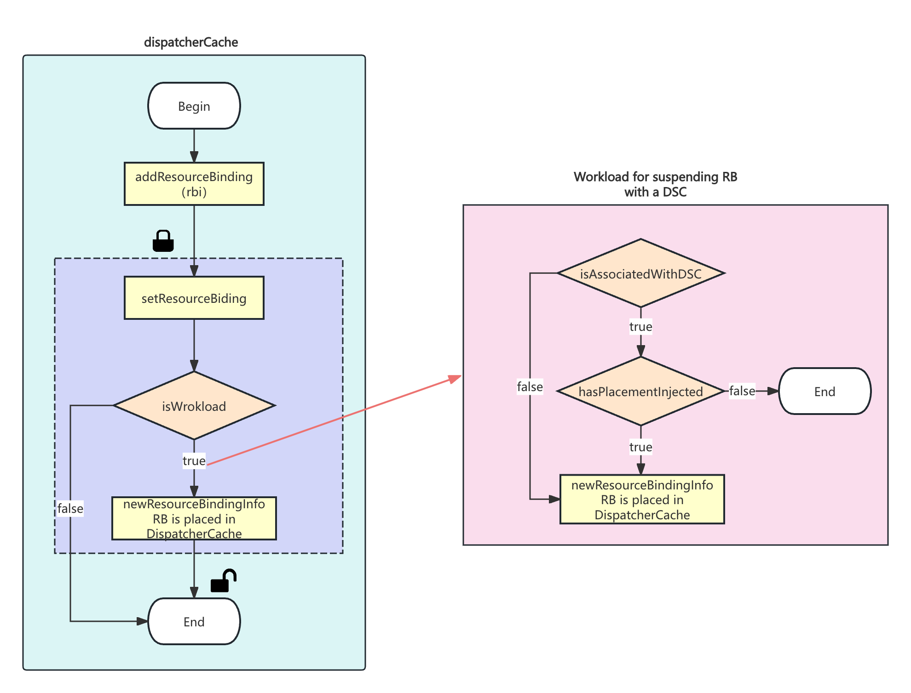
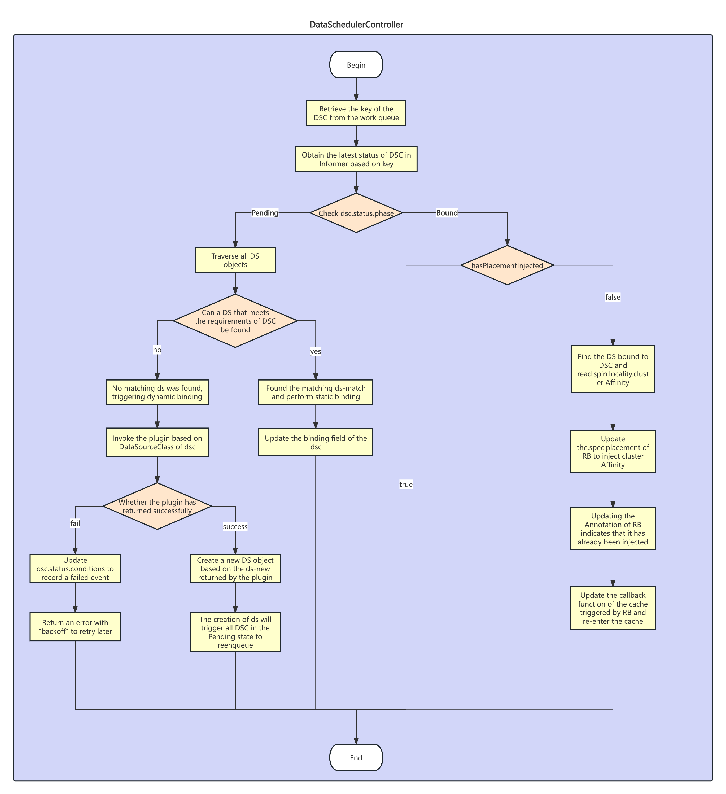

# **Proposal: Data-Dependency Scheduling with DataSource and DataSourceClaim**

## 1. Introduction

**Project Summary:**
Volcano Global, as a newly released multi-cluster scheduling platform from the Volcano community, aims to provide unified cross-cluster scheduling capabilities for high-performance computing tasks such as AI, Big Data, and HPC. It currently supports features like queue and job priorities, as well as multi-tenant fair scheduling. However, in big data scenarios, tasks often have complex data dependencies. For instance, Task C might depend on data generated by Task A. Currently, Volcano Global does not support such dependency constraints. This limitation means that the actual schedulability of tasks in a cross-cluster environment is constrained by the availability of data on the target cluster. Operators must manually analyze and configure the mapping between tasks and data sources, a process that is not only inefficient but also prone to causing cluster load imbalances. This is particularly challenging in multi-datacenter scenarios where direct cross-cluster data access is often restricted for security reasons, requiring data to be synchronized via platform-managed pipelines, further complicating the satisfaction of data dependencies.

This project aims to design and implement a pluggable, data-aware scheduling mechanism for Volcano Global to support data dependency constraints for big data tasks.

##  2. Proposed Architecture: The DS/DSC Model

The core idea is to decouple the "demand" for data from the "supply" of data by abstracting them into two independent API objects. A dedicated controller manages the binding process between them.

- **API Object:** kind: DataSource (DS)
- **Role:** Analogous to PersistentVolume (PV).
- **Concept:** A cluster-scoped resource representing a concrete, available data asset in the federated environment.
- **Provisioning:**
    1. **Static Provisioning:** Operators can manually register a known data source by applying a DataSource YAML.
    2. **Dynamic Provisioning:** The DataSchedulerController can invoke a provisioner plugin/webhook to discover and create a DS object on-demand when no static DS matches a user's claim. To avoid overwhelming etcd, DS objects are created on-demand rather than by auto-scanning and mirroring the entire external data catalog.

(The detailed Go struct for DataSource is provided in the Appendix.)

- **API Object:** kind: DataSourceClaim (DSC)
- **Role:** Analogous to PersistentVolumeClaim (PVC).
- **Concept:** A namespaced resource representing a user's or application's request for a specific type of data source.
- **Provisioning:** Created by application developers to declare data requirements for their workloads.

(The detailed Go struct for DataSourceClaim is provided in the Appendix.)
## 3.  Suspending Workloads for Placement Injection

A critical requirement of this design is to modify a ResourceBinding's placement before it's processed by the Karmada scheduler. This necessitates a mechanism to suspend the workload.

The volcano-global project already includes a mechanism to suspend Workload-type ResourceBinding objects via its admission webhook, handing them over to the Dispatcher for queue management. Our design will integrate with this existing flow.

- **V1 Scope**: In the first version, our DataSchedulerController will focus exclusively on ResourceBindings that have already been identified as Workloads and suspended by the existing volcano-global webhook. This ensures seamless, non-disruptive integration with the current system and covers the primary use case of AI/Big Data jobs.
- **Future Work**: The suspension mechanism can be enhanced in future versions by extending the webhook logic to recognize DataSourceClaim associations, thus enabling data-aware scheduling for non-Workload resources as well.

A race condition exists where the Dispatcher might process and unsuspend a ResourceBinding before our DataSchedulerController has had a chance to inject the data-aware placement.

To solve this, we propose modifying the entry point of the DispatcherCache. The setResourceBinding event handler will be updated with a pre-flight check:

1. **Check for DSC Association:** When a ResourceBinding event is received, the handler first checks if it's associated with a DataSourceClaim (via workloadSelector).
2. **Check for Placement Injection:** If it is associated, the handler then checks if the ResourceBinding has an annotation indicating that the DataSchedulerController has already successfully injected the placement.
3. **Defer Entry:** If the annotation is missing, the handler **defers** adding the RB to the cache by simply returning. The Dispatcher remains unaware of this RB.
4. **Allow Entry:** The DataSchedulerController will eventually update the RB with the placement and the annotation. This UPDATE event triggers the handler again. This time, the annotation is present, and the RB is allowed into the DispatcherCache to proceed with the normal dispatch flow.

This approach introduces a user constraint: the DSC must be created before the associated workload. This will be clearly stated in the user documentation.
## 4. High-Level Workflows

Image: Workflow for suspending workloads associated with a DSC.

Image: The reconcile loop of the DataSchedulerController, showing the DS/DSC matching and binding process.

## 5. Dynamic Provisioning and Extensibility

The dynamic provisioning of DS objects presents challenges related to service discovery and cross-cluster communication. The initial static-only model is valuable on its own, delivering key functionalities:

1. It creates a reliable information channel, solving the scheduler plugin's inability to access workload metadata.
2. It prevents oversized Cluster objects by moving data source information to dedicated DS objects.
3. It simplifies the architecture by removing the need for custom scheduler plugins, instead leveraging Karmada's native clusterAffinity.
4. It improves observability and separates concerns between data platform operators (managing DS) and application developers (requesting DSC).

For future extensibility, we propose a **Provisioner Plugin** model instead of a hardcoded webhook mapping. However, a more robust long-term solution is to adopt the agent-based model used by Karmada for Cluster objects.

- **The Agent Model**: An agent deployed in each member cluster would be responsible for:
    1. **Auto-discovery and synchronization**: The agent would monitor the local data systems (e.g., Hive Metastore) and automatically create/update DS objects in the Karmada control plane. This solves the problem of keeping DS objects up-to-date.
    2. **Resolving communication issues**: Since the agent runs locally, it can easily communicate with in-cluster services, completely solving the cross-cluster networking challenge for dynamic provisioning.

The design and implementation of this agent will be proposed in a separate, subsequent proposal after the core DS/DSC model is validated.

## 6.  API Design (Go Structs)
### DataSource API
```go
// +genclient
// +k8s:deepcopy-gen:interfaces=k8s.io/apimachinery/pkg/runtime.Object
// +k8s:openapi-gen=true

// DataSource represents an available data source in the federated environment.
// It is a cluster-scoped resource.
type DataSource struct {
	metav1.TypeMeta   `json:",inline"`
	metav1.ObjectMeta `json:"metadata,omitempty"`

	Spec   DataSourceSpec   `json:"spec,omitempty"`
	Status DataSourceStatus `json:"status,omitempty"`
}

type DataSourceSpec struct {
	// System specifies the underlying data system.
	// This provides context for the 'name' and 'attributes' fields.
	// e.g., "hive", "s3", "hdfs".
	// +required
	System string `json:"system"`

	// Type specifies the category of the data source within the system.
	// e.g., for system="hive", type could be "table", "view".
	// e.g., for system="s3", type could be "bucket", "object", "prefix".
	// +required
	Type string `json:"type"`

	// Name is the identifier of the data source, its format is interpreted
	// in the context of the 'system' and 'type'.
	// +required
	Name string `json:"name"`
	
	// Locality defines which clusters this data source is available on. 
	// +required 
	Locality *DataSourceLocality `json:"locality"`
	
	// Attributes provides extra, non-identifying metadata.
	// +optional
	Attributes map[string]string `json:"attributes,omitempty"`
	
	// ReclaimPolicy defines what happens to this DataSource when its last bound DataSourceClaim is deleted. 
	// +optional 
	ReclaimPolicy DataSourceReclaimPolicy `json:"reclaimPolicy,omitempty"`
}

// DataSourceLocality specifies the location of the data source.
type DataSourceLocality struct {
	// ClusterAffinity is a rule that specifies a set of clusters where the data source is located.
	// It uses the standard Kubernetes cluster affinity syntax.
	// This makes it directly usable by Karmada's placement spec.
	// +optional
	ClusterAffinity *policyv1alpha1.ClusterAffinity `json:"clusterAffinity,omitempty"`
}

// DataSourceStatus defines the observed state of DataSource.
type DataSourceStatus struct {
	// ClaimRefs is a list of references to DataSourceClaims that are bound to this DataSource.
	// The presence of items in this list indicates the DataSource is in use.
	// +optional
	ClaimRefs []corev1.ObjectReference `json:"claimRef,omitempty"`

	// BoundClaims counts the number of DataSourceClaims currently bound to this DataSource.
	// This provides a quick summary of its usage.
	// +optional
	BoundClaims int32 `json:"boundClaims,omitempty"`

	// Conditions store the latest available observations of the DataSource's state.
	// e.g., {type: "Ready", status: "True"}, {type: "Provisioned", status: "True"}
	// This is more flexible than a single phase.
	// +optional
	Conditions []metav1.Condition `json:"conditions,omitempty"`
}

// +k8s:deepcopy-gen:interfaces=k8s.io/apimachinery/pkg/runtime.Object

// DataSourceList contains a list of DataSource.
type DataSourceList struct {
	metav1.TypeMeta `json:",inline"`
	metav1.ListMeta `json:"metadata,omitempty"`
	Items           []DataSource `json:"items"`
}

type DataSourceReclaimPolicy string
const (
	ReclaimPolicyRetain DataSourceReclaimPolicy = "Retain"
	ReclaimPolicyDelete DataSourceReclaimPolicy = "Delete"
)
```
### 6.2 DataSourceClaim API
```go
// +genclient
// +k8s:deepcopy-gen:interfaces=k8s.io/apimachinery/pkg/runtime.Object
// +k8s:openapi-gen=true

// DataSourceClaim is a request for a DataSource by a user.
// It is a namespaced resource, and it must be created in the same namespace
// as the workload that requires the data.
type DataSourceClaim struct {
	metav1.TypeMeta   `json:",inline"`
	metav1.ObjectMeta `json:"metadata,omitempty"`

	Spec   DataSourceClaimSpec   `json:"spec,omitempty"`
	Status DataSourceClaimStatus `json:"status,omitempty"`
}

// DataSourceClaimSpec defines the desired state of DataSourceClaim.
type DataSourceClaimSpec struct {
	// System is the required underlying data system of the data source.
	// e.g., "hive", "s3", "hdfs".
	// This will be matched against the DataSource's spec.system field.
	// If dynamic provisioning is used, this field determines which provisioner/webhook to call.
	// +required
	System string `json:"system"`

	// DataSourceType is the required category of the data source within the system.
	// e.g., "table", "filesystem".
	// This will be matched against the DataSource's spec.type field.
	// +required
	DataSourceType string `json:"dataSourceType"`

	// AttributesSelector is a label selector over the attributes of a DataSource.
	// It allows users to request data sources with specific metadata, e.g., format=parquet.
	// This will be matched against the DataSource's spec.attributes field.
	// +optional
	AttributesSelector *metav1.LabelSelector `json:"attributesSelector,omitempty"`

	// DataSourceName is the name of a specific DataSource to pre-bind.
	// If specified, the controller will only attempt to bind to this specific DS,
	// ignoring selector fields.
	// +optional
	DataSourceName string `json:"dataSourceName,omitempty"`

	// WorkloadSelector is a label selector over the workload(s) that this claim is for. 
	// The DataSchedulerController will find workloads (like VcJob, Deployment) in the same namespace 
	// that match this selector, and then suspend their associated ResourceBindings. 
	// This allows a single DSC to apply to multiple workloads if their labels match. 
	// +required 
	WorkloadSelector *metav1.LabelSelector `json:"workloadSelector"`
}

// DataSourceClaimStatus defines the observed state of DataSourceClaim.
type DataSourceClaimStatus struct {
	// Phase indicates the current lifecycle phase of the claim.
	// Can be "Pending" (waiting for a matching DS) or "Bound" (successfully bound).
	// +optional
	Phase DSCPhase `json:"phase,omitempty"`

	// BoundTo is the name of the DataSource this claim is successfully bound to.
	// This field is populated by the controller when the phase transitions to "Bound".
	// +optional
	BoundTo string `json:"boundTo,omitempty"`

	// Conditions store the latest available observations of the claim's state.
	// This is used to convey detailed information about the claim's status,
	// such as reasons for provisioning failure.
	// +optional
	Conditions []metav1.Condition `json:"conditions,omitempty"`
}

// +k8s:deepcopy-gen:interfaces=k8s.io/apimachinery/pkg/runtime.Object

// DataSourceClaimList contains a list of DataSourceClaim.
type DataSourceClaimList struct {
	metav1.TypeMeta `json:",inline"`
	metav1.ListMeta `json:"metadata,omitempty"`
	Items           []DataSourceClaim `json:"items"`
}

// --- Enums and other constants ---
type DSCPhase string
const (
	DSCPhasePending DSCPhase = "Pending"
	DSCPhaseBound   DSCPhase = "Bound"
)
```